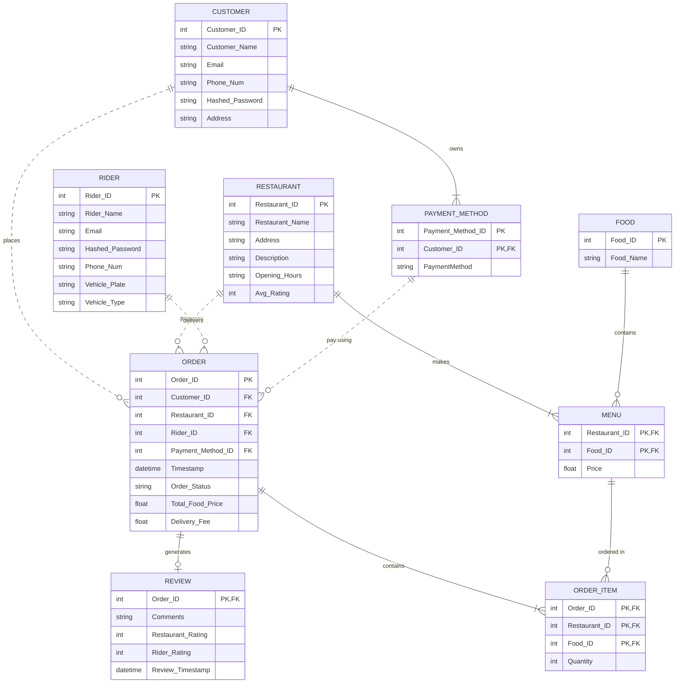

```mermaid
erDiagram
    CUSTOMER ||..o{ ORDER : places
    CUSTOMER ||--|{ PAYMENT_METHOD : owns
    RESTAURANT ||--|{ MENU : makes
    FOOD ||--o{ MENU : contains
    RESTAURANT ||..o{ ORDER : prepares
    RIDER ||..o{ ORDER : delivers
    ORDER ||--o| REVIEW : generates
    PAYMENT_METHOD ||..o{ ORDER : "pay using"
    ORDER ||--|{ ORDER_ITEM : contains
    MENU ||--o{ ORDER_ITEM : "ordered in"

    CUSTOMER {
        int Customer_ID PK
        string Customer_Name
        string Email
        string Phone_Num
        string Hashed_Password
        string Address
    }
    RESTAURANT {
        int Restaurant_ID PK
        string Restaurant_Name
        string Address
        string Description
        string Opening_Hours
        int Avg_Rating
    }
    RIDER {
        int Rider_ID PK
        string Rider_Name
        string Email
        string Hashed_Password
        string Phone_Num
        string Vehicle_Plate
        string Vehicle_Type
    }
    FOOD {
        int Food_ID PK
        string Food_Name
    }
    MENU {
        int Restaurant_ID PK, FK
        int Food_ID PK, FK
        float Price
    }
    ORDER {
        int Order_ID PK
        int Customer_ID FK
        int Restaurant_ID FK
        int Rider_ID FK
        int Payment_Method_ID FK
        datetime Timestamp
        string Order_Status
        float Total_Food_Price
        float Delivery_Fee
    }
    REVIEW {
        int Order_ID PK, FK
        string Comments
        int Restaurant_Rating
        int Rider_Rating
        datetime Review_Timestamp
    }
    PAYMENT_METHOD{
        int Payment_Method_ID PK
        int Customer_ID PK, FK
        string PaymentMethod
    }
    ORDER_ITEM {
        int Order_ID PK, FK
        int Restaurant_ID PK, FK
        int Food_ID PK, FK
        int Quantity
    }
```
