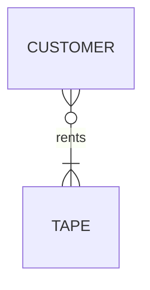
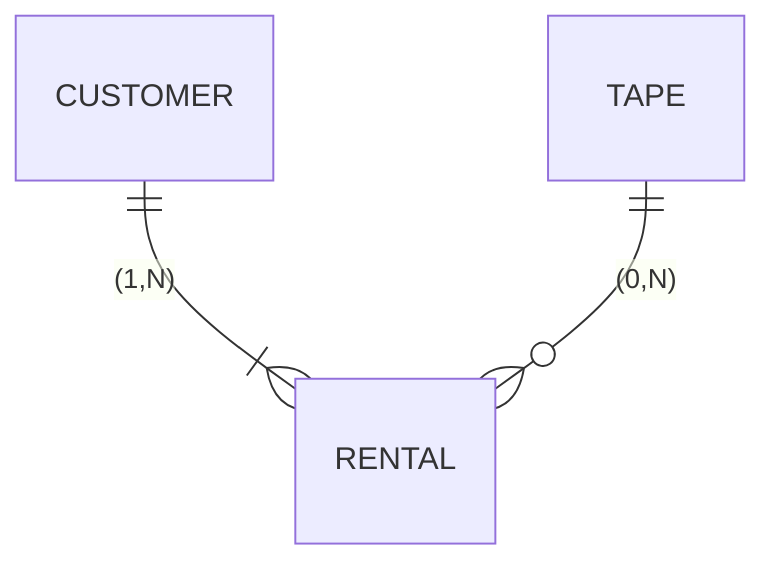
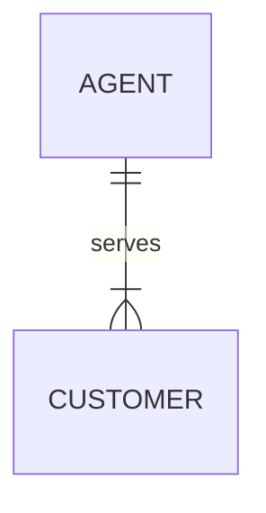
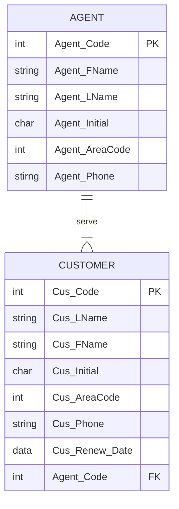

# Lab 3 Guide: Create Database & gsqL -f

## Part A: Discussion

1. How are many-to-many relationships (M:N) addressed in the development of an E-R diagram (Entity Relationship Diagram)? Give an example of a M:N relationship & explain how it is addressed for the internal model.

Although M:N relationships may properly be viewed in a conceptual model, you cannot directly implement them in an **RDBMS (Relational DataBase Management System)** and hence they have to be modified for the internal model. Therefore, an M:N relationship must be decomposed into two 1:M relationships, centered upon a composite entity. 

For example: a video rental database can have the same tape being rented by many customers, and the same customer renting many tapes. 

**Conceptual Model**

Note that the O is only next to customer because when the video rental company buys a new tape, it hasn’t been yet rented by any customer but they already must enter it into the database. However, they don’t enter a new person into their database until that person actually becomes a customer by renting a tape.

This M:N relationship must be transformed into 2 1:M relationships with a composite entity in the middle:

**Internal Model**

Note that the O now is on the side of RENTAL going to TAPE. Ask the students, “Why is this?” And try to get them to figure it out before telling them the answer.

The answer: the CUSTOMER record only gets created when he rents a TAPE. So this means that a CUSTOMER must have a relationship with RENTAL. Whereas the TAPE record was created before anyone rented it. So, the association with RENTAL is optional.

Note: The relational schema is diagrammatic representation of the tables in the database itself. This proves that our ER diagram above was truly **an internal model** and not just a conceptual model, since it can be actually **implemented in a real database**.

2. What is the difference between a composite key, a composite attribute and a composite entity?

- A composite **key** is a key that consists of more than one attribute. Example: (stu_LName, stu_FName, stu_Iinit, stu_Phone) -> stu_Hrs
- A composite **attribute** is an attribute which can be further subdivided to yield additional attributes Example: address -> city, street, state, zip code
- A composite entity, also known as the **bridge** entity, is used as a bridge to break M:N relationships into **two sets** of **1:M relationships**.

3. What is a derived attribute? Give an example.

A derived attribute is an attribute whose value can be **calculated** from **another attribute**. For example, **age** (current date (year) – date of birth (year)). This **age attribute is not physically stored in the database**.

4. Explain briefly the THREE data abstraction levels. 
   1. **External model** – represents the user’s **view** of the **data environment**
   2. **Conceptual model** – represents the **global view** of the entire organization data. It integrates all the external models into a single global view
   3. **Internal model** – is the **representation** of the **database as seen by the DBMS**.

5. Draw a Crowfoot diagram based on the following diagram:

**Crowfoot**

*Student may include the attribute, connectivity, relationship participant and cardinality if they know the concept. Else, this can be modified later once it has been covered in lecture.*

E.g. **An agent can serve many customers**. Each customer must be served by only 1 agent

