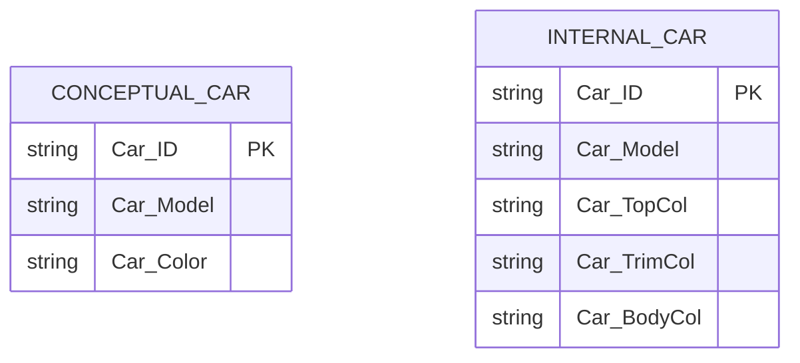
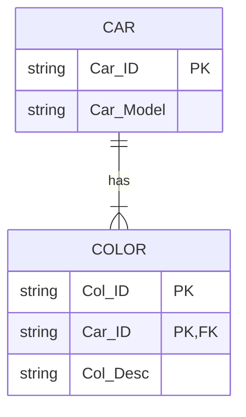
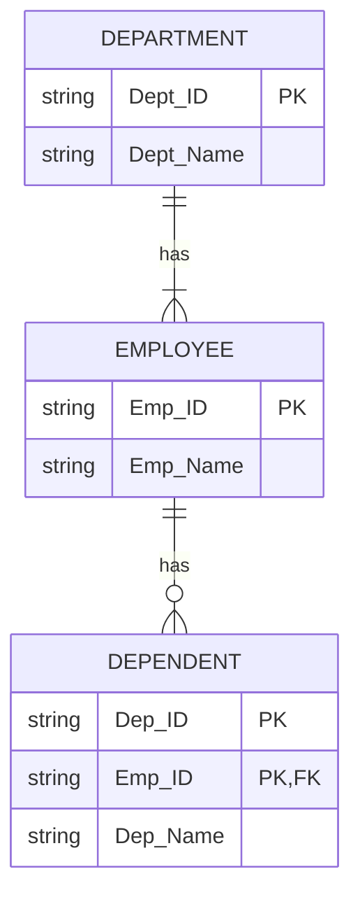

# Lab 4 Guide: ERD; Drop, Create, Alter, & Insert

## Part A: Discussion

1. What is multivalued attribute? Give TWO examples.

Multivalued attribute is an attribute that can have many values. Examples:
- A **car** (an entity) could have several different **colors** (a multivalued attribute) on different parts of the car.
- A **student** (an entity) may have several **email addresses** (a multi valued attribute).
- Each student has many skills.

2. Referring to Q1, explain briefly TWO solutions on how a multivalued attribute is implemented in a relational database. 

- Within the original entity,  split the multivalued attribute into new attributes (e.g., topcolor, bodycolor, interiorcolor, etc.)

- Create a new entity from a multivalued attribute and relates back to the original entity by 1:M relationship

3. Draw a complete E-R Diagram based on the following business rules:
    - A company operates five departments.
    - Each department has employees.
    - Each employee works for only one department
    - The largest department has 30 employees
    - Each employee may or may not have one or more dependents
    - Computers are located in a designated room.
    - Each employee may use any computer in the room
    - Each computer may be used by more than one employee on different days. 

    1. Identify all possible entities. Hint: An entity is normally a noun that can be found in the business rule.
    2. Let’s examine each of the entities that are listed out. Is it necessary to include every entity that can be found in the business rules? Explain your answer.
    3. Let’s examine the relationships between the entities. List out possible relationship between every two entities you listed out in question 2(b), specify whether it is a mandatory ( | )or optional ( 0 ) relationship, and specify the cardinality (whether 1:1, 1:M, M:N etc)
    4. Complete the ERD using the elements you identified in steps Q3 (a) to (c).
  

**Conceptual Database:**

**Internal Database:**

